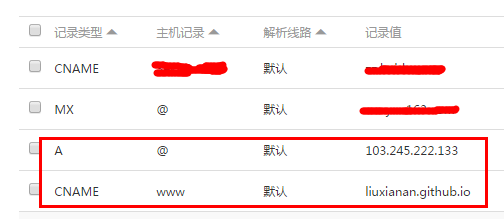

# 标题 
# 分隔线 
---
***

# 强调
* *hello斜体*
* _hello斜体_
* **hello粗体** 
* __hello粗体__
~~删除线~~
# 表格
| 标题 | 标题 | 标题 |
|------|------|------|
| a    | b    | c    |


| 左对齐标题 | 右对齐标题 | 居中对齐标题 |
| :------| ------: | :------: |
| 短文本 | 中等文本 | 稍微长一点的文本 |
| 稍微长一点的文本 | 短文本 | 中等文本 |

# 转义 \
# 表情符号
:laughing: :cry: :clap: :cat2: :dog:

# 引用
> 这是区块引用

> ## 引用中的文本格式化
> 内容
> * 列表1
> * 列表2

# 列表
* 无序
* 列表

+ 无序
+ 列表

1. 有序
2. 列表

# 代码区块
    缩进1个制表符或4个空格

# 链接
* 行内式 [百度](http://www.baidu.com)
* 自动链接 <http://baidu.com>
* 参考式 [链接][id] 
[id]: http://www.baidu.com "可选标题"

# 图片
* 行内式
* 参考式![说明文字][img]
[img]:./image/cname.png "可选说明"

# 代码块
支持的语言列表 
```
actionscript3
apache
applescript
asp
brainfuck
c
cfm
clojure
cmake
coffee-script, coffeescript, coffee
cpp - C++
cs
csharp
css
csv
bash
diff
elixir
erb - HTML + Embedded Ruby
go
haml
http
java
javascript
json
jsx
less
lolcode
make - Makefile
markdown
matlab
nginx
objectivec
pascal
PHP
Perl
python
profile - python profiler output
rust
salt, saltstate - Salt
shell, sh, zsh, bash - Shell scripting
sql
scss
sql
svg
swift
rb, jruby, ruby - Ruby
smalltalk
vim, viml - Vim Script
volt
vhdl
vue
xml - XML and also used for HTML with inline CSS and Javascript
yaml
```

  

# [写数学公式](https://docs.mathjax.org/en/latest/index.html)
## 安装配置
安装渲染
```sh
npm un hexo-renderer-marked --save
npm i hexo-renderer-pandoc --save # 或者 hexo-renderer-kramed
```
主题配置中:
```yml
math:
  enable: true
  #是否每页需要验证( 下面的头部标记 )
  per_page: true
  engine: mathjax
```

头部验证，如果不需要渲染数学公式,在可以在文章头部加上下面那行,反之为true
```yml
mathjax: false
```
## 结构
单行结构:
``` latex
$$\begin{equation}
e=mc^2
\end{equation}\label{eq1}$$

```
单行简约结构:
``` latex
$1+1=3$
```
复杂单行: 
```
$ J_\alpha(x) = \sum_{m=0}^\infty \frac{(-1)^m}{m! \Gamma (m + \alpha + 1)} {\left({ \frac{x}{2} }\right)}^{2m + \alpha} \text {，行内公式示例} $
```

多行结构
```latex
$$\begin{equation}
\begin{aligned}
a &= b + c \\
  &= d + e + f + g \\
  &= h + i
\end{aligned}
\end{equation}\label{eq2}$$
```
公式对齐 
```
$$\begin{align}
a &= b + c \label{eq3} \\
x &= yz \label{eq4}\\
l &= m - n \label{eq5}
\end{align}$$
```
不想要编号
```latex
$$\begin{align}
-4 + 5x &= 2+y \nonumber  \\
 w+2 &= -1+w \\
 ab &= cb
\end{align}$$
```

公式引用:
```
著名的质能方程 $\eqref{eq1}$ 由爱因斯坦提出 ...
```

另一种标记
```latex
$$x+1\over\sqrt{1-x^2} \tag{i}\label{eq_tag}$$
```
公式编号
``` latex
\begin{equation}
E=mc^2 \text{，自动编号公式示例}
\label{eq:Sample}
\end{equation}
```
编号公式引用
```
$$在公式 \eqref{eq:Sample} 中，我们看到了这个被自动编号的公式。$$
```

